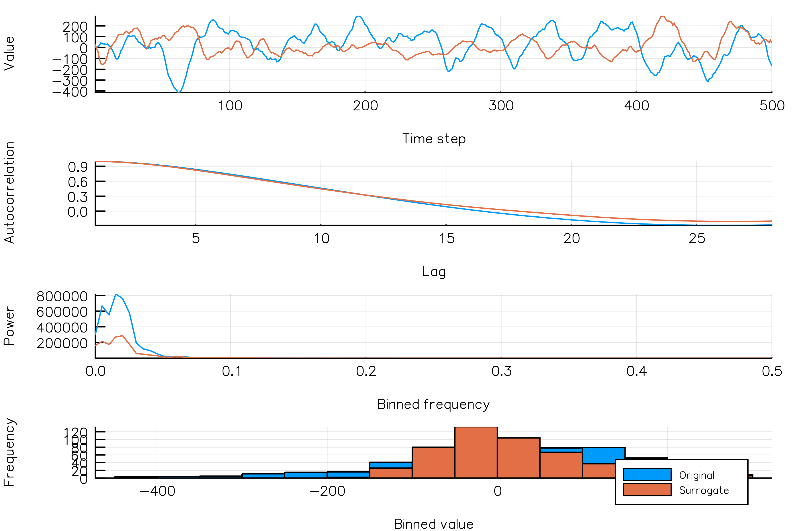
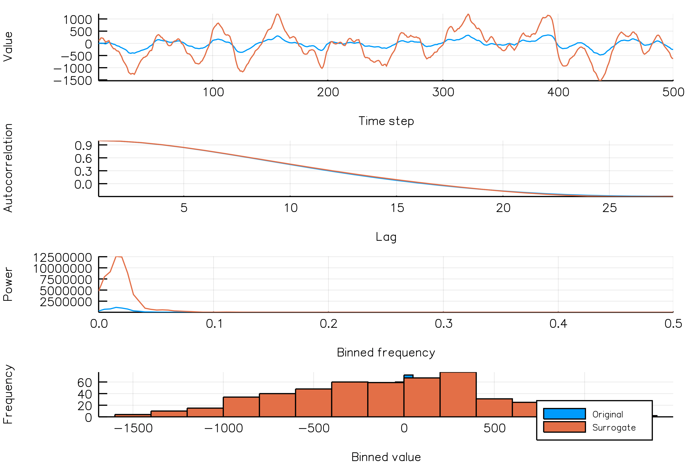
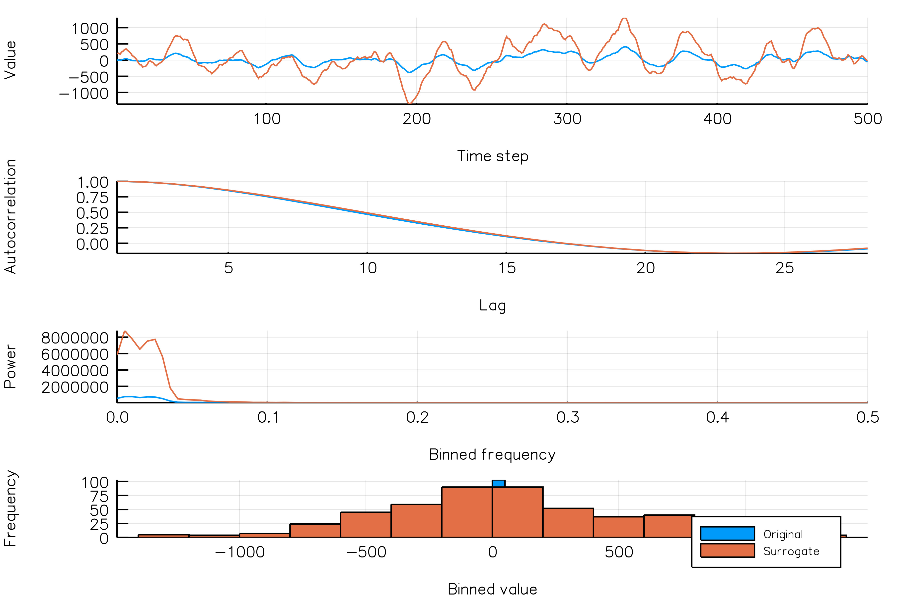

# Fourier surrogates (FS)
Fourier surrogates are a form of constrained surrogates created by taking the Fourier
transform of a time series, then shuffling either the phase angles or the amplitudes of the
resulting complex numbers. Then, we take the inverse Fourier transform, yielding a surrogate
time series.


## Random phase surrogates
```@docs
TimeseriesSurrogates.randomphases
```

Here's how you would generate a phase surrogate realization of a time series.

```@example
using TimeseriesSurrogates

# Generate a time series. This time, we'll use a NSAR2() process.
ts = NSAR2()

# Generate a random phase surrogate realization
surrogate = randomphases(ts)

# Plot the surrogate along with the time series it is based on, along with autocorrelation
# and periodogram plots.
surrplot(ts, surrogate)
```

### How do random phase surrogates vary across realizations?
Below is a plot showing different phase surrogate realizations (orange) over the same time series (blue).
Each frame in the animation is a different surrogate realization. Note that the autocorrelations
are roughly similar across realizations.

```julia
randomphases_NSAR2_gif(n_iters = 30, fps = 5)
```



In the next animation, the time series (blue) for which we generate surrogates change between
frames. One phase surrogate realization (orange) is generated for each of the time series. Notice
that, again, the phase surrogates accurately represents the autocorrelation of the
different initial time series.

```julia
randomphases_NSAR2_gif(n_iters = 30, fps = 5, new_realization_every_iter = true)
```


## Random amplitude surrogates

```@docs
TimeseriesSurrogates.randomamplitudes
```

This is how you would generate a random amplitude surrogate realization of a time series.

```@example
using TimeseriesSurrogates

# Generate a time series. Again, we'll use a NSAR2() process.
ts = NSAR2()

# Generate a random amplitude surrogate realization
surrogate = randomamplitudes(ts)

# Plot the surrogate along with the time series it is based on, along with autocorrelation
# and periodogram plots.
surrplot(ts, surrogate)
```

### How do random amplitude surrogates vary across realizations?

Below is a plot showing different phase surrogate realizations (orange) over the same time series (blue).

```julia
randomamplitudes_NSAR2_gif(n_iters = 30, fps = 5)
```



In the next animation, as above, each frame shows a new time series (blue), which every frame is another unique realization of the NSAR2
process, and one surrogate realization of the time series (orange).


```julia
randomamplitudes_NSAR2_gif(n_iters = 30, fps = 5,
                        new_realization_every_iter = true)
```


