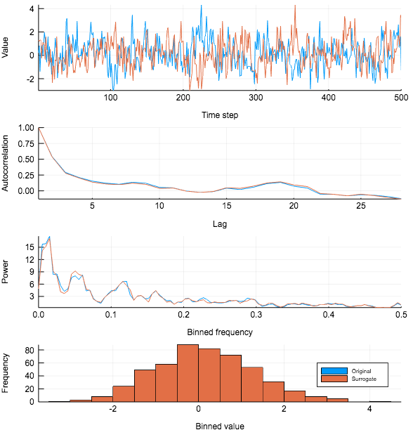

# What is a surrogate?

## The method of surrogate testing

The method of [surrogate testing](https://en.wikipedia.org/wiki/Surrogate_data_testing) [1]
is a statistical method for testing properties about a dynamical system whose governing
equations is not known.
This happens when the only information we have available about the system is a time series.

Surrogate testing can be used to test, for example, the following properties
about a data set or the underlying process [2]:
1. does the dataset show evidence of nonlinearity?
2. does the dataset show evidence of low-dimensional chaos?

### What is a surrogate time series?
Let's say we have a nontrivial time series, call it X, consisting of `n` observations.
A surrogate time series for X is another time series of `n` values which (roughly) preserves
one or many mathematical/statistical properties of X.

The upper panel in the figure below shows an example of a time series (blue) and one
surrogate realization that preserves its autocorrelation (orange).  The time series "look
alike", which is due to the fact the surrogate realization almost exactly preserved the
power spectrum and autocorrelation of the time series, as shown in the lower panels.

## Types of surrogate realizations
The preserved statistical properties can be anything, and must be decided based on which
null hypothesis one wants to test for.

Following the convention of Theiler and Prichard (1996), there are two main types of
surrogates: constrained realizations and typical realizations.

### Constrained realizations
The values of a constrained surrogate realization of a time series is just a shuffling of
the values of the original time series. With `TimeseriesSurrogates.jl`, you can construct
the following types of constrained surrogate realizations:
1. [Random shuffle surrogates (RS)](@ref). Destroys any linear correlation in the signal, but preserves its amplitude distribution.
2. [Fourier surrogates (FS)](@ref). Have the same linear correlation, or periodogram, as X.
3. [Amplitude adjusted Fourier transform surrogates](@ref). Have the same linear correlation and the amplitude distribution as X.

### Typical realizations
Typical surrogate realizations are not generated by a permutation of the original values of
the time series. Rather, they are generated by fitting some model to the data (intented to
capture some important property of the system), and then using that model to generate
surrogate realizations of the time series.

## Literature references
1. Theiler et al., Testing for nonlinearity in time series: the method of surrogate data, Physica D 58 (1992) 77-94.

2. Theiler & Prichard, Constrained-realization Monte-Carlo method for hypothesis testing, Physica D 94 (1996) 221-235
