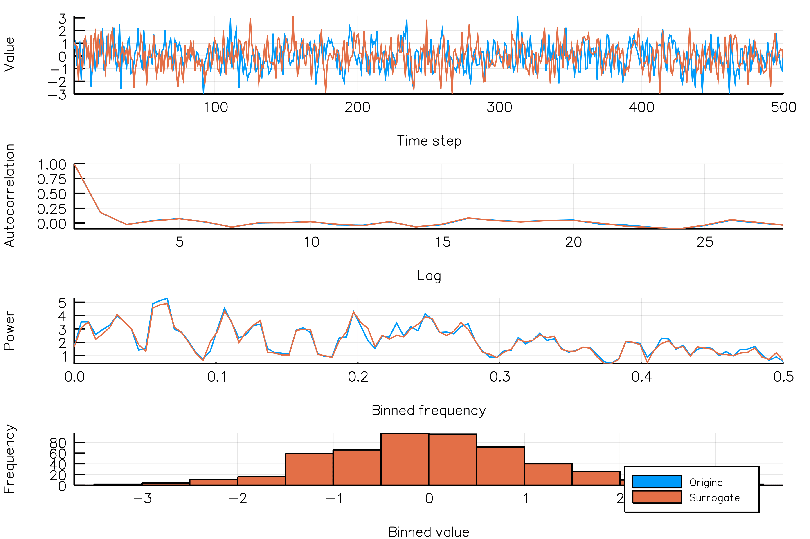
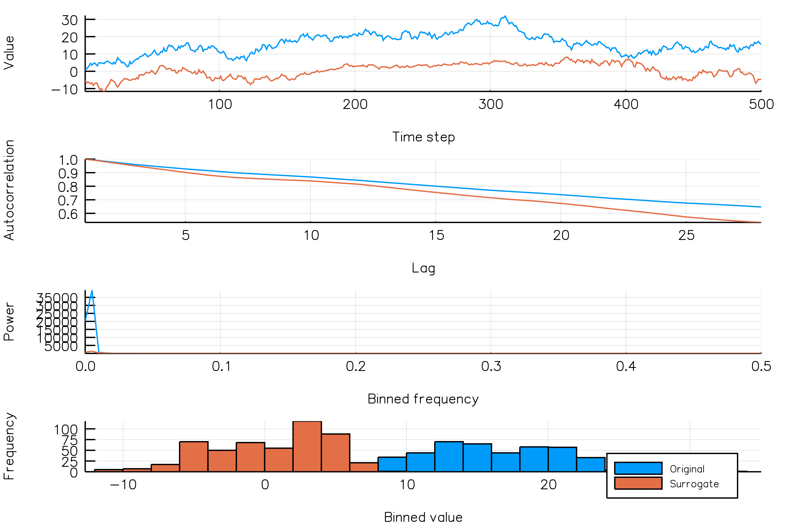

# Visualizing surrogates

## Autocorrelation / periodogram panels
Visualizing a surrogate realization is easy.

Let's say we want to generate an IAAFT surrogate and visualize the time series and surrogate time series, together with the corresponding periodograms,  autocorrelation functions and histograms. This can be done as follows:

```@example
using TimeseriesSurrogates
ts = diff(rand(300))
iaaft_plot(ts)
```

Here, the blue lines correspond to the original time series, while orange lines correspond to the surrogate time series. In this particular case, it seems that the IAAFT surrogate well reproduced the autocorrelation of the original time series.

All surrogate functions come have a complementary functions that also plots a panel
showing the autocorrelation function and periodogram of the time series and its surrogate
realization:
- `randomphases` has `randomphases_plot`
- `randomamplitudes` has `randomamplitudes_plot`
- `aaft` has `aaft_plot`
- `iaaft` has `iaaft_plot`

## Animate panels (and export to .gif)

Say you want to examine which surrogate method is suited for a particular dataset. It would then be useful to visualize multiple surrogate realizations for that time series.

For this purpose, each surrogate function comes with a corresponding animation functions (`randomphases_anim`, `randomamplitudes_anim`, `aaft_anim`, `iaaft_anim`) and gif creation functions (`randomphases_gif`, `randomamplitudes_gif`, `aaft_gif`, `iaaft_gif`).

You can either generate the gif file directly, or create a `Plots.animation` instance containing the animation.

Here's some examples:

```julia
using TimeseriesSurrogates
ts = diff(rand(300))

# Creating a gif directly

# Create a gif using the default number (15) surrogates
iaaft_gif(ts)
iaaft_gif(ts, fps = 3) # specify frame rate

# Specify that we want 100 different surrogate realizations
iaaft_gif(ts, n_iters = 100)
iaaft_gif(ts, n_iters = 100, fps = 1) # specify frame rate
```

If you for some reason don't want a gif directly, then you could do

```julia
# Use the `gif` function from `Plots.jl` to create a gif
anim = iaaft_anim(ts, n_iters = 50) # create an animation
gif(anim)
gif(anim, fps = 3) # specifying frame rate
```

### Examples

#### IAAFT realizations of an AR1 process
```julia
iaaft_AR1_gif(n_iters = 20, fps = 2)
```



#### IAAFT realizations of a NSAR2 process
```julia
iaaft_NSAR2_gif(n_iters = 100, fps = 10)
```


#### Random phase realizations of a random walk

```julia
randomphases_randomwalk_gif(n_iters = 10, fps = 1, new_realization_every_iter = true)
```



## Plot/animation/gif docs

You can use any of the following functions to generate plots, animations and the animations as gif files.

```@docs
TimeseriesSurrogates.randomshuffle_plot
TimeseriesSurrogates.randomamplitudes_plot
TimeseriesSurrogates.randomphases_plot
TimeseriesSurrogates.aaft_plot
TimeseriesSurrogates.iaaft_plot

TimeseriesSurrogates.randomshuffle_anim
TimeseriesSurrogates.randomamplitudes_anim
TimeseriesSurrogates.randomphases_anim
TimeseriesSurrogates.aaft_anim
TimeseriesSurrogates.iaaft_anim

TimeseriesSurrogates.randomshuffle_gif
TimeseriesSurrogates.randomamplitudes_gif
TimeseriesSurrogates.randomphases_gif
TimeseriesSurrogates.aaft_gif
TimeseriesSurrogates.iaaft_gif
```
